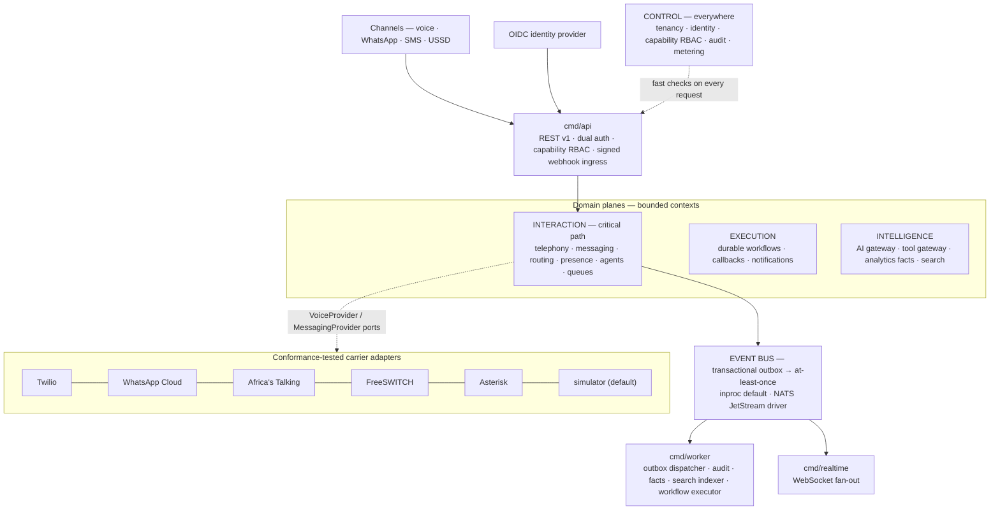

# Orvexa

**The AI-native contact center OS — open infrastructure for customer conversations that remember, route, and resolve.**

Orvexa is a four-plane, event-driven Go core where customers, conversations, AI agents and business workflows form one continuous system — with every carrier, LLM and datastore behind tested, swappable ports.

---

## Why Orvexa

The contact-center industry still runs on 1990s CRUD: banks of agents with no memory of the customer, per-seat pricing with per-minute carrier lock-in, and bolt-on AI that never touches the actual workflow. Orvexa rebuilds the stack as infrastructure:

- **One conversation, many channels.** A phone call is *not* the customer relationship — it is one interaction inside a continuous conversation. WhatsApp → voice → email on the same conversation keeps one context; identity normalization means a phone number can never fork into two customers (asserted by tests: [`internal/customers`](internal/customers)).
- **Four planes, one critical path.** Interaction, Intelligence, Execution and Control communicate only through the event bus, defined interfaces or the API — nothing outside telephony → routing → agent may block a live call.
- **Carrier-agnostic by construction.** Twilio, WhatsApp Cloud, Africa's Talking, FreeSWITCH, Asterisk and the built-in simulator sit behind two ports ([`internal/telephony/ports.go`](internal/telephony/ports.go), [`internal/messaging/ports.go`](internal/messaging/ports.go)) and must pass the same conformance kit to merge. Switching carriers is an env var, not a rewrite.
- **AI with a safety boundary.** AI suggestions are metered; every AI→side-effect call passes a deny-by-default tool gateway that allowlists, schema-validates, rate-limits and audits — refusals included.

## Architecture

Four planes around a transactional event backbone; three stateless deployables; carriers behind a hexagon:

| Plane | Owns | Critical path? |
|---|---|---|
| **Interaction** | Realtime customer interactions: telephony, messaging, routing, agent assignment | **Yes** — nothing else may block a call |
| **Intelligence** | AI gateway, tool gateway, transcription, analytics facts, search | No — consumes events, fails independently |
| **Execution** | Durable workflows, callbacks, notifications | No — event-driven consumers |
| **Control** | Tenancy, identity, authorization, metering, audit | Yes — but only as fast checks |

Core domain model: **Customer → Conversation → Interaction → Case → Workflow**. Decisions live in the [ADRs](docs/adr) — start with [ADR-0001](docs/adr/0001-modular-distributed-architecture.md) (planes), [ADR-0004](docs/adr/0004-event-delivery-and-outbox.md) (outbox), [ADR-0005](docs/adr/0005-provider-agnostic-communications.md) (hexagon).

